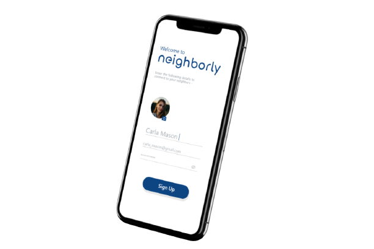
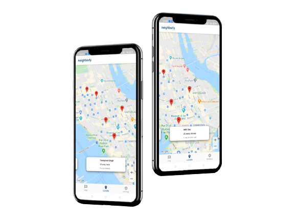

 

 
### _A Geofencing based Flutter Application for People to interact with each other Virtually during pandemic._ 📱 
 

## Why Use Neighbourly ?

Beneficiary/User segment this solution is intended for-
- This app has been made for the general public so they can make new friends amongst their nearest neighbors.

How it helps the beneficiary/user segment-
- This is a place where one can interact with strangers safely without the medical risks and thus make new confidants and companions.

Impact that the solution would create-
- The extra peripheral contact that had been lost, this app can help overcome that.
- This App encourages our profoundly human and evolutionarily hard-wired impulses for connections : seeing our friends, getting together in groups, or making new ones.
- Sharing the same moment of fun with new friends creates the bonding which could help battle the loneliness of lockdown.

Effectiveness of solution and ease of implementation -
- This idea is in itself a win-win situation for both the users as individual (as they can overcome loneliness), and the society as a whole since it reduces risk of virus spreading more.

## Unique Features

- User can select a person within a given range using Geofencing (polylines).
- It is available free of cost.
- User has to give their consent in order to interact with incoming chat request from another user .

## Insights 

  
&nbsp; &nbsp; &nbsp; &nbsp;
   

## License
_Copyright 2021_ **Aditya Das, Rupanshi Chawda and Taranpreet Singh Chabbra**  

## Support
Neighbourly is an MIT-licensed Open Source Project. You can help it grow by showing some love and contributing. If you'd like to support, feel free to make a pull request and we'll love to review it ✨
